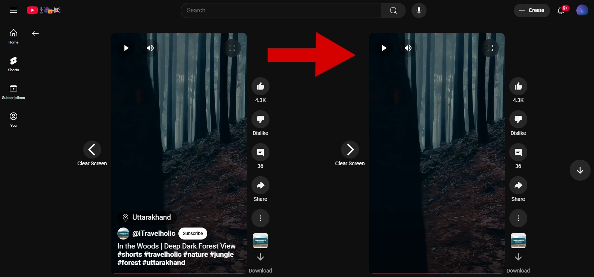
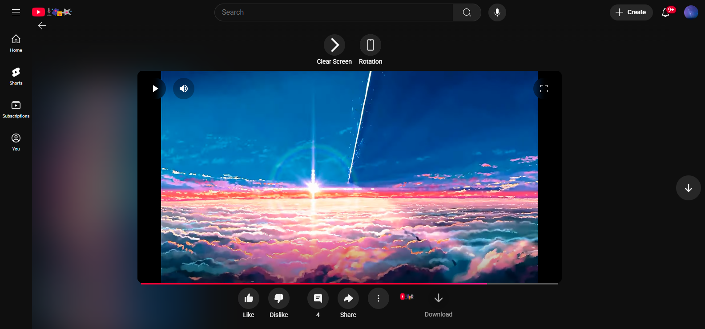
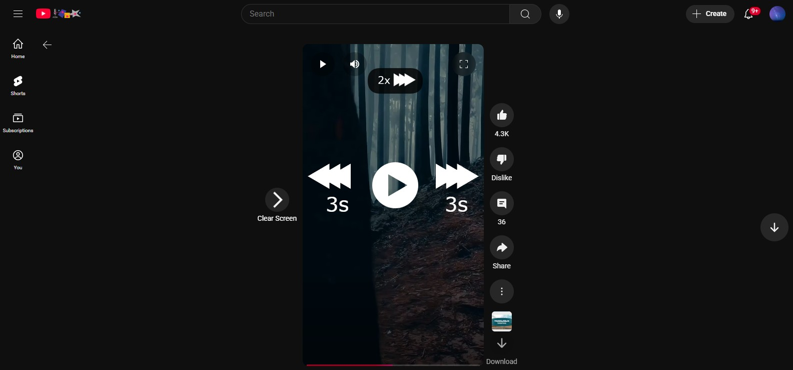
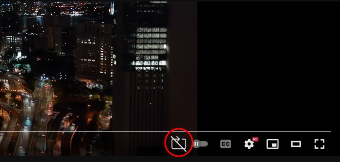

# YouTools

**YouTools** is a Chrome extension that allows better customization and control over both Shorts and regular video playback on YouTube.

## Description

YouTools enhances the YouTube experience by providing advanced customization and control features for both Shorts and regular videos. It focuses on improving video controls, visual clarity, screen orientation, and playback behavior.

## Features and Usage

The extension’s features are divided into two types: those for **regular videos** and those for **Shorts**.

### 🔧 How to Use

1. Open the extension popup (top-right corner of your Chrome window).
2. Enable the features you want (Shorts or regular video features).
3. Once enabled, the extension will automatically detect the video type (Short or regular) and inject feature buttons accordingly.
4. Toggle each feature on or off per video using the provided buttons, **except the "Controls" feature**, which works automatically after being enabled from the popup.

---

### 🎬 Shorts

#### 1. **Clear-Screen**  
Hide or show video overlays like the channel icon, title, buttons, etc.

- 📍 **Where**: Button appears on the **left side** of the Short.
- ✅ **How to use**:  
  Click the Clear-Screen button to hide overlays. Click again to bring them back.

#### 2. **Rotation**  
Rotate landscape Shorts for easier viewing on devices like desktops or laptops.

- 📍 **Where**: Button appears on the **left side** of the Short.
- ✅ **How to use**:  
  1. Hover over the rotation button.  
  2. A list of rotation directions will appear (e.g., 90°, 180°, etc).  
  3. Click your desired rotation.  
  4. Click the button again to reset to default (portrait) mode.


#### 3. **Controls**  
Adds gesture-based playback control to Shorts.

- ✅ **How to use** (after enabling from popup):
  - **Skip forward**: Double-click the right half of the video.
  - **Skip backward**: Double-click the left half.
  - **Fast-forward**: Long-press anywhere on the video.
- ⚠️ This feature works automatically — no button will appear on the video.

  

---

### 📺 Regular Videos

#### 1. **Loop**  
Auto-replays standalone videos after they finish playing.

- 📍 **Where**: Button appears at the **bottom right** of the video (next to captions, quality, etc).
- ✅ **How to use**:
  1. Enable the loop feature from the extension popup.
  2. When watching a video, click the loop button to toggle auto-replay on or off.

---

## Installation

### Option 1: Build from Source

1. Download or clone this repository:  
   `git clone https://github.com/nasrerhg/YouTools.git`
2. Install dependencies and build:  
   ```bash
   cd YouTools
   npm install
   npm run build
3. Open Chrome and go to `chrome://extensions/`.
4. Enable **Developer Mode** (top left).
5. Click **"Load unpacked"** and select the extension folder path/Youtools/dist.
6. The extension should now be active and ready to use.

## 🪪 License

This project is licensed under the [MIT License](LICENSE).
